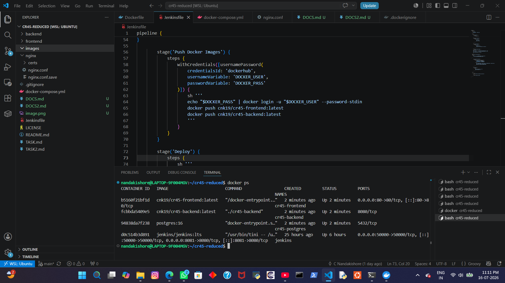
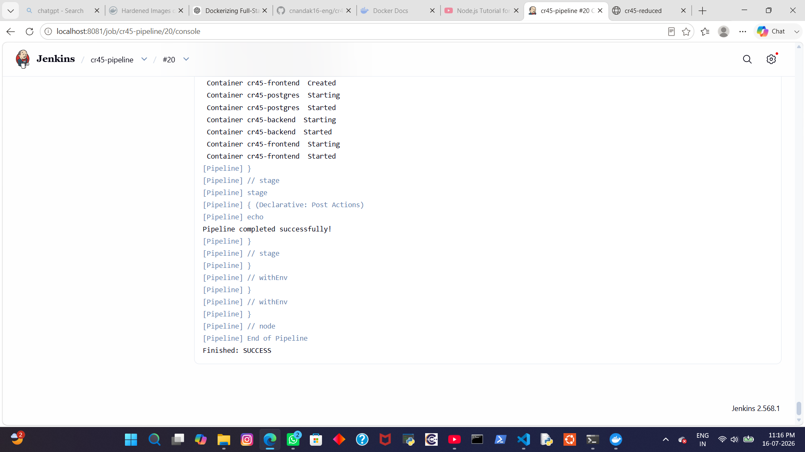

# Reverse Proxy

The application uses **Nginx** as a reverse proxy.

Responsibilities of the reverse proxy:

- Serves the frontend application.
- Forwards API requests to the Go backend.
- Provides a single public entry point.
- Simplifies client-server communication.

Typical request flow:

```
Browser
    │
    ▼
Nginx Reverse Proxy
    │
    ├────────► React Frontend
    │
    └────────► Go Backend API
```

The reverse proxy configuration is stored in:

```
nginx/nginx.conf
```

---

# Docker Compose

Docker Compose orchestrates the following services:

- PostgreSQL Database
- Backend Service
- Frontend Service
- (Optional) Nginx Reverse Proxy

Images are pulled directly from Docker Hub during deployment rather than rebuilt on the deployment machine.

---

# Pipeline Architecture

```
GitHub
   │
   ▼
 Jenkins
   │
   ├── Checkout
   ├── Build Frontend
   ├── Build Backend
   ├── Build Docker Images
   ├── Push Images to Docker Hub
   └── Deploy with Docker Compose
                 │
                 ▼
         Running Docker Containers
                 │
                 ▼
          Nginx Reverse Proxy
          ├────────► Frontend
          └────────► Backend
```

---

# Validation

The provided project does not include:

- Frontend lint scripts (`npm run lint`)
- Frontend automated tests (`npm test`)
- Go unit tests (`*_test.go`)

Therefore, Jenkins validates the application by successfully building both the frontend and backend before creating Docker images and deploying them.

---

# Results

The pipeline successfully performs:

- Source checkout from GitHub
- Frontend build
- Backend build
- Docker image creation
- Docker Hub image publishing
- Image deployment using Docker Compose
- Automatic application update

Pipeline Result:

```
Finished: SUCCESS
```
# Jenkins CI/CD Pipeline

## Objective

Automate the development workflow using Jenkins by:

- Building the frontend and backend applications.
- Building Docker images for all services.
- Pushing Docker images to Docker Hub.
- Automatically deploying updated services using Docker Compose.
- Routing client requests through an Nginx reverse proxy.

---

# Project Structure

```
.
├── backend/
├── frontend/
├── nginx/
│   ├── nginx.conf
│   └── certs/
├── docker-compose.yml
├── Jenkinsfile
└── README.md
```

---

# Technologies Used

- Jenkins
- Docker
- Docker Compose
- Docker Hub
- React + Vite
- Go
- PostgreSQL
- Nginx Reverse Proxy

---

# Jenkins Pipeline Workflow

The Jenkins pipeline consists of the following stages.

## 1. Checkout

Fetches the latest code from the GitHub repository.

```
checkout scm
```

---

## 2. Frontend Build

```
cd frontend
npm install
npm run build
```

Builds the React application using Vite.

---

## 3. Backend Build

```
cd backend
go mod download
go build -o cr45-backend ./cmd/server
```

Compiles the Go backend server.

---

## 4. Build Docker Images

```
docker compose build
```

Creates Docker images for:

- Frontend
- Backend

---

## 5. Push Docker Images

On every push to the **main** branch, Jenkins:

- Logs into Docker Hub
- Pushes

```
cnk19/cr45-frontend:latest
cnk19/cr45-backend:latest
```

---

## 6. Automatic Deployment

After successful image upload:

```
docker compose pull
docker compose up -d
```

The latest images are downloaded from Docker Hub and the running containers are updated automatically.

---

